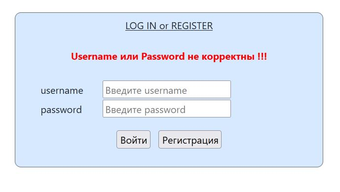
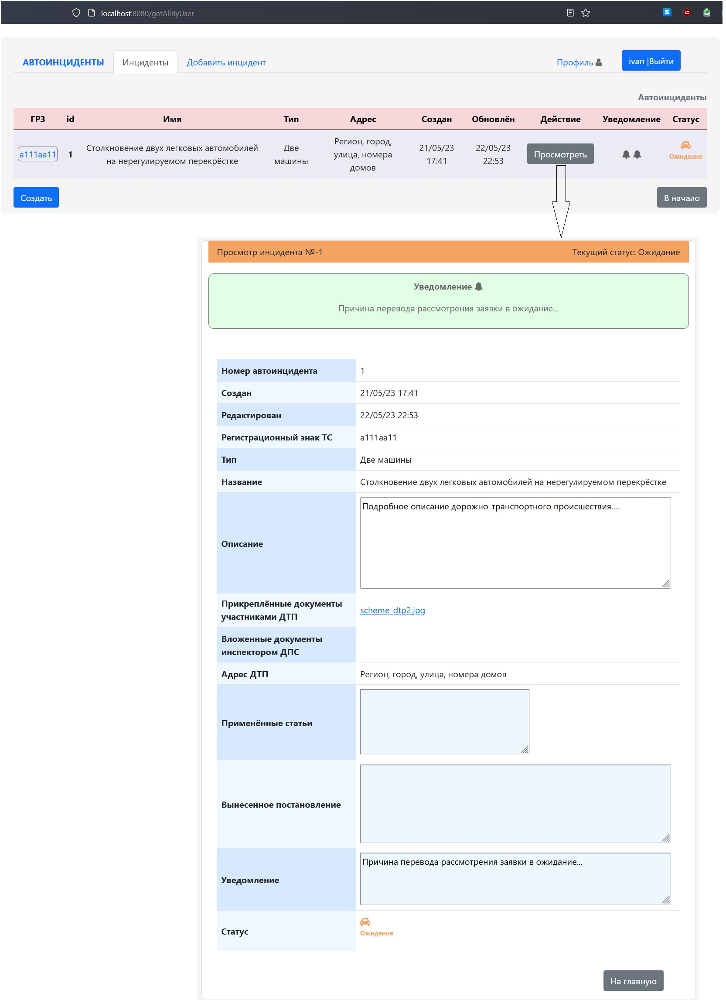

# job4j_accidents
#### Сервис "Сайт_Дистанционное урегулирование дорожно-транспортных происшествий"

[](https://app.travis-ci.com/MasterMaxTs/project_accidents)


&nbsp;&nbsp;&nbsp;<br>
&nbsp;&nbsp;&nbsp;<br>
&nbsp;&nbsp;&nbsp;
&nbsp;&nbsp;&nbsp;
&nbsp;&nbsp;&nbsp;
&nbsp;&nbsp;&nbsp;
&nbsp;&nbsp;&nbsp;<br>
&nbsp;&nbsp;&nbsp;
&nbsp;&nbsp;&nbsp;
&nbsp;&nbsp;&nbsp;
&nbsp;&nbsp;&nbsp;<br>
&nbsp;&nbsp;&nbsp;
&nbsp;&nbsp;&nbsp;
&nbsp;&nbsp;&nbsp;
&nbsp;&nbsp;&nbsp;<br>
&nbsp;&nbsp;&nbsp;
&nbsp;&nbsp;&nbsp;
&nbsp;&nbsp;&nbsp;
&nbsp;&nbsp;&nbsp;<br>
&nbsp;&nbsp;&nbsp;
&nbsp;&nbsp;&nbsp;<br><br>
&nbsp;&nbsp;&nbsp;


### Это проект по созданию сайта "Автонарушители", доступного в браузере.
В системе существуют две роли: _Обычные пользователи_ и _Автоинспекторы_.

    Прежде чем пользоваться функционалом приложения, обычному пользователю необходимо пройти процедуру регистрации,
    включающую в себя заполнение аутентификационных данных и карточек учёта собственных транспортных средств:
        
        > username
        > password
        > email
        > Имя
        > Фамилия
        > Регистрационный знак автомобиля
        > Номер свидетельства регистрации автомобиля
        > VIN - код автомобиля

<br>

---
#### Данный проект позволит зарегистрированным пользователям в роли _Обычный пользователь_:
1. Создавать электронные заявки с описанием дорожно-транспортного происшествия (ДТП):
<br><br>
    > В заявлении пользователь указывает:
    > * государственный регистрационный знак (ГРЗ) собственного транспортного средства;
    > * краткое название ДТП;
    > * вид ДТП по типу столкновения;
    > * детальное описание ДТП с приложенными фотографиями;
    > * адрес ДТП.

<br>

2. Отправлять заполнененную электронную заявку на рассмотрение автоинспектору(ам)

<br>

3. Отслеживать в реальном времени статус сопровождения электронной заявки:
<br><br>

   > * <em>"Принят"</em>&emsp;&emsp;&emsp;&emsp;&emsp; &emsp;&emsp;cоздание пользователем заявки в приложении
   > * <em>"Рассматривается"</em>  &emsp;&nbsp;&nbsp;&nbsp;&nbsp;рассмотрение автоинспектором заявки пользователя
   > * <em>"Возвращён"</em>&emsp;&emsp;&emsp;&nbsp;&nbsp; &emsp;&emsp;возврат автоинспектором заявки пользователю 
   > * <em>"Скорректирован"</em>&nbsp;&nbsp;&emsp;&emsp;отредактированная пользователем возвращённая заявка
   > * <em>"Решён"</em>&emsp;&emsp;&emsp;&emsp;&emsp;&emsp;&emsp;&nbsp;&nbsp;решение автоинспектором заявки пользователя
   > * <em>"Архив"</em>&emsp;&emsp;&emsp;&emsp;&emsp;&emsp;&emsp;&nbsp;&nbsp;добавление автоинспектором решённой заявки пользователя в архив
   > * <em>"Ожидание"</em>&emsp;&emsp;&emsp;&emsp;&emsp;&nbsp;приостановка автоинспектором рассмотрения заявки пользователя

<br>

4. Отслеживать и читать в реальном времени уведомления от автоинспектора(ов) в процессе рассмотрения заявки:
<br><br>
   > * &emsp;&emsp;&emsp;&emsp;&emsp;&emsp;&emsp;&emsp;&emsp; перевод заявки в статус <em>"Решён"</em>
   > * &emsp;&emsp;&emsp;&emsp;&emsp;&emsp;&emsp;&emsp; перевод заявки в статус <em>"Ожидание"</em>
   > * &emsp;&emsp;&emsp;&emsp;&emsp;&emsp;&emsp; перевод заявки в статус <em>"Возвращён"</em>

<br>

___
#### Данный проект позволит зарегистрированным пользователям в роли _Автоинспектор_:
1. Рассматривать, переводить в ожидание, возвращать, завершать, архивировать и удалять электронные заявки от пользователей

   > При <ins>приостановке</ins> рассмотрения заявки автоинспектор может (по усмотрению) отправить текстовое уведомление пользователю
   >
   > При <ins>завершении</ins> заявки автоинспектором в заявлении заполняются поля:
    >    > * перечисляются применённые статьи к ДТП;
    >    > * дополняются фотографии с места ДТП (не обязательно);
    >    > * выносится постановление
   >
    > При <ins>возврате</ins> заявки пользователю автоинспектор должен описать причину возврата в предоставляемой форме
    >
   > <ins>Удаление</ins> заявки пользователя возможно, если заявка имеет статус сопровождения <em>"Архив"</em>:
     >    >* доступно удаление одной архивной заявки;
     >    >* доступно удаление всех архивных заявок (очистка архива);

<br>

2. Выполнять фильтрацию электронных заявок на основе фильтров и поиска заявок по ГРЗ автомобиля

    > Для быстрого доступа к элементам навигационного меню, связанных с обработкой заявок, на начальной странице и страницах с отфильтрованными заявками созданы дополнительные панели ссылок:
     >    > * Главная страница:<br><br><br>
     >    > * Страница фильтрации:<br><br><br>
     >    > * Страница ожидающих решения заявок:<br><br><br>
     >    > * Страница возвращённых заявок:<br>

<br>

3. Администрировать пользователей приложения:
- просматривать профиль;
- изменять доступ пользователю в приложение: разрешать, блокировать;
- выполнять поиск пользователя по username

<br>

---
### Стек технологий

- Java 11
- Spring-boot-starter-web v.2.7.8.
- Spring-boot-starter-thymeleaf v.2.7.8.
- Spring-data-jpa v.2.7.4
- Spring-jdbc v.5.3.25
- Spring-orm v.5.3.25
- Spring-security v.5.7.6
- Hibernate-core v.5.6.11.
- Bootstrap v.5.0.2.

- Lombok v.1.18.26.
- СУБД: PostgreSQL v.14.0.
<br><br>
- Тестирование:
  - Spring-boot-starter-test v.2.7.8.
  - БД: h2database v.2.1.214

<br>

- Упаковка проекта: Web Archive (.war)

---
### Требования к окружению
- Java 11
- Maven v.3.6.3
- PostgreSQL v.14.0

<br>

---
### Запуск проекта
1. Установить СУБД PostgreSQL


2. Создать базу данных с именем accidents:<br>
   ```create database accidents;```


3. Скачать файлы проекта с github по ссылке и разархивировать в выбранную директорию:<br>
   [https://github.com/MasterMaxTs/project_accidents/archive](https://github.com/MasterMaxTs/project_accidents/archive/refs/heads/master.zip)


4. Перейти в директорию проекта, открыть командную строку.</br>
 - Для <ins>первого</ins> запуска приложения выполнить последовательно команды:
     - ```mvn install```
     - ```java -jar target/accidents-1.0.war```
     - внизу окна командной строки скопировать в буфер обмена url:
         <br>http://localhost:8080/index


 - Для <ins>последующего</ins> запуска приложения выполнять команду:
     - ```java -jar target/accidents-1.0.war```
     - внизу окна командной строки скопировать в буфер обмена url:
         <br>http://localhost:8080/index

       
5. Вставить из буфера обмена url в адресную строку браузера:<br>
   [http://localhost:8080/index](http://localhost:8080/index)


6. В базу данных пользователей сайта добавлена одна учётная запись пользователя в роли Администратор.

   > администратору сайта необходимо выполнить вход в приложение со следующими учётными данными и сменить пароль через
    вкладку <Профиль> навигационного меню.
   > * логин: _root_
   > * пароль: _secret_


7. Документацию к проекту можно посмотреть в директории проекта в файле:<br>
    ```target/site/apidocs/index.html```

<br>

---
### Закрытие проекта
Закройте окно командной строки либо:
1. Запишите id процесса (PID) в логах из командной строки:
   
2. Через диспетчер устройств выполните завершение процесса c этим PID


<br>

---
### Взаимодействие с приложением

1. Вид страницы аутентификации/регистрации пользователя


<br>

2. Вид страницы при не успешной аутентификации пользователя



<br>

3. Вид страницы регистрации нового пользователя


<br>

4. Вид страницы при не успешной регистрации нового пользователя


<br>

5. Вид страницы при успешной регистрации нового пользователя


<br>

6. Обычный пользователь - Вид главной страницы


<br>

7. Обычный пользователь - Вид страницы профиля и страниц редактирования профиля


<br>

8. Обычный пользователь - Вид страницы для создания новой заявки


<br>

9. Обычный пользователь - Вид страницы при успешном создании заявки


<br>

10. Обычный пользователь - Вид главной страницы с созданной заявкой и страницы просмотра карточки учёта ТС


<br>

11. Обычный пользователь - Вид главной страницы с созданной заявкой и страницы просмотра заявки


<br>

12. Обычный пользователь - Вид страницы редактирования заявки


<br>

13. Обычный пользователь - Вид страницы, при невозможности редактирования заявки


<br>

14. Администратор приложения - Вид главной страницы с раннее созданной пользовательской заявкой


<br>

15. Администратор приложения - Вид страниц при решении заявки


<br>

16. Обычный пользователь - Вид главной страницы с решённой заявкой


<br>

17. Администратор приложения - Вид страниц при переводе заявки в архив


<br>

18. Администратор приложения - Вид страниц при удалении заявки из архива


<br>

19. Администратор приложения - Вид страниц при переводе заявки в ожидание


<br>

20. Обычный пользователь - Вид главной страницы с заявкой, ожидающей решения



<br>

21. Администратор приложения - Вид страниц при возврате заявки


<br>

22. Обычный пользователь - Вид главной страницы с возвращённой заявкой


<br>

23. Администратор приложения - Вид страниц администрирования пользователя и страницы со всеми пользователями


<br>

24. Администратор приложения - Вид страницы успешного поиска пользователя по его username


<br>

25. Администратор приложения - Вид страницы неуспешного поиска пользователя по его username


<br>

26. Администратор приложения - Вид главной страницы со всеми заявками пользователей


<br>

27. Администратор приложения - Вид страницы успешного поиска заявок по регистрационному знаку автомобиля


<br>

28. Администратор приложения - Вид страницы не успешного поиска заявок по регистрационному знаку автомобиля


<br>

29. Администратор приложения - Вид страниц при фильтрации заявок из раздела Фильтр в навигационном меню 


<br>

30. Администратор приложения - Вид страниц при удалении всех архивных заявок (очистка архива)


<br>

---
### Особенности технической реализации учебного проекта

<br>

1. <ins><b>Слой репозитория</b></ins>
  - 1.1. Репозиторий Автомобильных инцидентов:

| Интерфейс                          | Реализации	                    | Описание	                                      |
|:-----------------------------------|:-------------------------------|:-----------------------------------------------|
| AccidentRepository                 | HibernateAccidentRepository    | доступ к хранилищу в БД с помощью Hibernate    |
| AccidentRepository                 | JdbcTemplateAccidentRepository | доступ к хранилищу в БД с помощью JdbcTemplate |
| AccidentRepository                 | MemAccidentRepository          | доступ к хранилищу в памяти                    |
| AccidentPagingAndSortingRepository | -                              | доступ к хранилищу в БД с помощью Spring Data  |

<br>

  - 1.2. Репозиторий Cопроводительных документов:

| Интерфейс               | Реализации	            | Описание	                                     |
|:------------------------|:-----------------------|:----------------------------------------------|
| DocumentRepository      | MemDocumentRepository  | доступ к хранилищу в памяти                   |
| DocumentCrudRepository  | -                      | доступ к хранилищу в БД с помощью Spring Data |


<br>
<br>

2. <ins><b>Слой сервиса</b></ins>
  - 2.1. Сервис Автомобильных инцидентов:

| Интерфейс               | Реализации	            | Описание	                                                                            |
|:------------------------|:-----------------------|:-------------------------------------------------------------------------------------|
| AccidentService         | AccidentServiceImpl    | сервис автоинцидентов с внедрением зависимости от AccidentRepository                 |
| -                       | AccidentDataService    | сервис автоинцидентов с внедрением зависимости от AccidentPagingAndSortingRepository |

<br>

  - 2.2. Сервис Сопроводительных документов:

| Интерфейс               | Реализации	            | Описание	                                                                             |
|:------------------------|:-----------------------|:--------------------------------------------------------------------------------------|
| DocumentService         | DocumentServiceImpl    | сервис cопроводительных документов с внедрением зависимости от MemDocumentRepository  |
| -                       | DocumentDataService    | сервис cопроводительных документов с внедрением зависимости от DocumentCrudRepository |


<br>
<br>

3. <ins><b>Профили сборки проекта и файлы конфигурации приложения</b></ins>

 | Профиль         |            Файл 	            |                Файл  	                |
|:----------------|:----------------------------:|:-------------------------------------:|
| Тестовый (test) | db/liquibase_test.properties | resources/application-test.properties |
| Продакшн (prod) |  db/liquibase.properties  	  | resources/application-prod.properties |


<br>
<br>

4. <ins><b>Виды главной страницы приложения</ins></b>

| Роль пользователя |     Имя вида      |  
|:------------------|:-----------------:|
| ROLE_USER         | user/index/index  | 
| ROLE_ADMIN        | admin/index/index | 


<br>

---
### Контакты
* email: max86ts@gmail.com
* telegram: matsurkanov